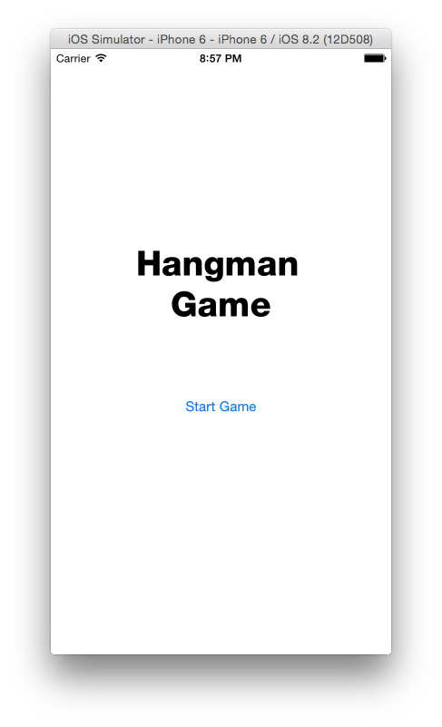
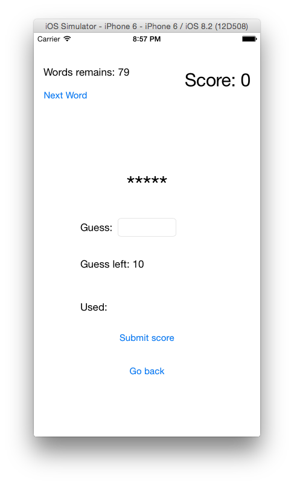

# Hangman Game

## Introduction
This is a iOS version of hangman game, it contain two page, start page and main page.  

## Start Page
Start page will appear every time you launch the app. When you hit 'start game' button, it will initialize a new game and pop up to the main page, mostly of the game will happen there.  

## Main Page

At main page, the upper left area contain a label indicating how much word remain to be guess, and a button to get another word. The upper right area show the score you have now.

The center area contain a label showing the current word you are guessing, and a text field to enter the next letter you want to guess.

Below them a label telling you how much more wrong guess you can have to guess the current word.
And a label to mark every letter you have guessed.

On the bottom, there is a button to submit you score, and a button to go back to the start page.

## Work Flow

1. lauch the app, click 'start game' to start a new game.
2. when entering main page, it will automatically request a new word for you.
3. enter every letter you want to guess one by one, when you successfully guess a letter, the current word will show the letter you guess, when guess fail, the wrong guess label will decrease by one.
4. When guess the whole word out or running out of guess or any time you want to change a word, you can click 'next word' button, and the word remain number will drop by one.
5. for 2-4 step, after each step it will automatically update the score.
6. repeat 2-5 until word run out or you want to stop
7. click 'submit score' to submit your score, then exit to start page
8. or click 'back' button directly exit to start page

## Validate Input

When you enter anything in the textfield, it perform a validation check. If input is more than one letter, or the input contain anything but english letter, it will show a error. 

After the input pass the validation, it will turn the input into UPPER case letter and perform a guess connection.

## Used Third Party Library

[AFNetworking](https://github.com/AFNetworking/AFNetworking)

[MBProgressHUD](https://github.com/jdg/MBProgressHUD)